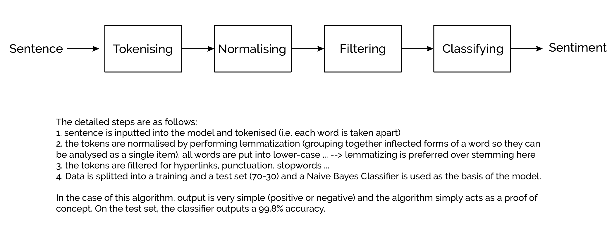

The code above is a predictive sentiment analysis using NLTK library and a simple Baysian Classifier to output a binary prediction on the sentence's overal sentiment: positive or negative. The code architecture is shown in the figure below.  

Language: Python  
Librairies:  
- NumPy  
- NLTK  
- re  

Files: 
- sentiment_analysis.ipynb is the main file to run which has the entire code  
- NLP.py is the version of the notebook condensed in a Python code  

